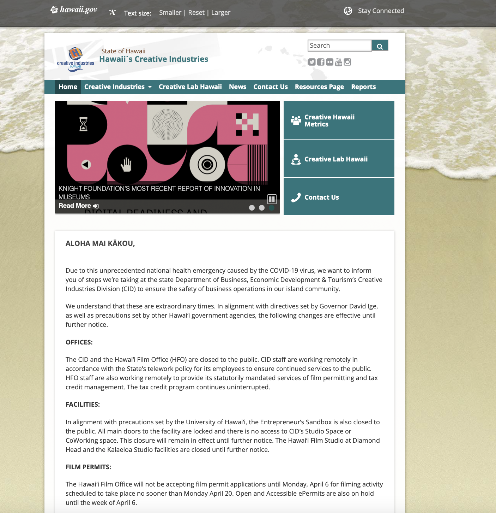

# Creative Industry Resources for Visitors and Residents of Hawaii 
## Assignment #1: Heuristic Evaluation of Hawaii Government Websites
Diana Alamari, Digital Humanities 110: User Experience and Design

---

Hawaii has a broad range of government websites for their divisions. The intent of each division's website is to provide informative content from which the website user can benefit. The user is typically a perspective visitor or perhaps a current/new resident of Hawaii. Beneficial information on each division may vary, but typically it should at least be updated for currently relevant usage, and user-friendly to obtain what content a user wants out of their usage. 

Some divisions of Hawaii's government contain more flaws than others. It is crucial to determine what flaws are present to improve usability. For this reason, I am going to evaluate usability conditions of two Hawaii website divisions: [Hawaii's Creative Industries](https://cid.hawaii.gov) and [Hawaii State Department of Health](https://health.hawaii.gov)
. I selected these two very different divisions because of my interest in those division topics and their presentation through their websites. By selecting two very different websites for heuristic evaluation, I was able to obtain broader context on their strengths and weaknesses. 

The heuristic evaluation performed allowed me to determine which website I am interested in improving: The Creative Industries website. Gathering usability problems among each website will serve as a foundation off of which I will present an improved website design of the Creative Industries division for the Hawaii website. 

# Website 1: [Hawaii's Creative Industries](https://cid.hawaii.gov)

The website for Hawaii's Creative Industries is simple and presents general information on the type of industries Hawaii has to offer. The main content provided are general news and organizational resources for the following creative industries: Applied Design, Film, Interactive Media, Literary Arts/Publishing, Performing Arts & Music, and Visual Arts. 

## Overall Impression:
This website has major flaws regarding those in itself. The simple presentation is not representative of the divisions creative industries. Also, the website is extremely limited in the information provided, lacking the ability to provide users with relevant updated news and content that actually serves the typical type of user's needs. Users of this website are inferred to be creatives that are interested in useful resources and activities in Hawaii, and the website should be designed as such. Instead, the website contains generic information, lacks relevant activity searches, updated information, and detailed resources.

**1. Visibility of system status**
> - Always keep users informed about what is going on.
> - Provide appropriate feedback within reasonable time. 

**Evaluation**
- Good: Menu options are highlighted when you click to go onto their corresponding pages.
- Bad: News button is an important menu option yet is not highlighted when selected like the rest of the menu options.

> **Suggestions** 
> - Highlight the News menu to match the rest of the menu options.

**2. Match between system and the real world**
> - Speak the users' language, with words, phrases and concepts familiar to the user, rather than system-oriented terms. 
> - Follow real-world conventions, making information appear in a natural and logical order. 

**Evaluation**
Bad:
- Home page does not contain an introduction to the state and its website’s content. It has a COVID update on closed departments, and even that does not have an introduction/headline.
- The headline “Aloha Mai Kakou” is followed by the COVID update content, and yet there is no seamless transition. 

> **Suggestions**
> - Place introduction directly underneath the header of the home page "Aloha Mai Kakou" and place COVID update at the very top of the page
>   - Or, keep COVID update in the same spot, but in smaller font and boxed to clearly distinguish it as an update.
> - Create a short introduction with the existing industries that are individually boxed directly underneath.

**3. User control and freedom** 
> - Users often choose system functions by mistake.
> - Provide a clearly marked "out" to leave an unwanted state without having to go through an extended dialogue. 
> - Support undo and redo. 

**Evaluation**
- Good: Website allows one to smoothly return to the previous page with the browser’s standard previous page/undo button.
- Bad: Page sources particularly for news updates are very confusing between which to maneuver. The “news”, “press release”, and “featured” selections above each news update blog are misleading; they all lead to their own pages only when you click them on those news blog pages. There is no option to undo those selections and head back to the main news menu on those pages, even though those pages say that they subsequently are derived from that “news” page. 

> **Suggestions** 

**4. Consistency and standards**
> - Users should not have to wonder whether different words, situations, or actions mean the same thing. 
> - Follow platform conventions. 

**Evaluation**
- Bad: Confusing words/sections. Related to the above content, a page such as “news” will demonstrate new initiatives within the state, but the top of each news’ blog updates on separate pages says “in featured, main, press releases.” 
- The layout of this sequence is confusing for one to read because it is placed on the top of the page in a way that implies you can head back to the news page, but the news page is not clickable.

> **Suggestions**
> f
> f
 

**5. Error prevention**
> - Even better than good error messages is a careful design which prevents a problem from occurring in the first place. 

**Evaluation**
- Searching for particular topics will result in many irrelevant search results. For example, searching for “music activities” pops up with a 2017 news article with content related to its title which is “Creative Lab Hawaii Announces Participants and Coaches for 2017 Music Immersive”, which is not only outdated, but also is not relevant to discovering music activities.

> **Suggestions** 
> k

**6. Recognition rather than recall** 
> - Make objects, actions, and options visible. 
> - User should not have to remember information from one part of the dialogue to another. 
> - Instructions for use of the system should be visible or easily retrievable whenever appropriate. 

**Evaluation**
- Bad: Due to the lack of submenus under the main “news” menu bar as mentioned earlier, you have to remember that you can only be redirected to news page subcategories (such as those mentioned above under #5 and #6) under individual blogs on the news page. 

> **Suggestions**
> d
> d

**7. Flexibility and efficiency of use** 
> - Accelerators -- unseen by the novice user -- may often speed up the interaction for the expert user so that the system can cater to both inexperienced and experienced users. 
> - Allow users to tailor frequent actions. 

**Evaluation**
- There is extra navigation involved that is unnecessary. 
- It is difficult to efficiently navigate within the entire news section of the website, which has the most content on the website. There is no menu, submenu, or any form of clickable option to get to the “press release” and “featured” pages.  
- You are only able to click onto those pages within the news pages’ individual blog posts. You are unable to click on a dedicated press release or featured submenu selection (that should fall under the “news” menu option).

> **Suggestions** 
> f
> f

**8. Aesthetic and minimalist design**
> - Dialogues should not contain information which is irrelevant or rarely needed. 
> - Every extra unit of information in a dialogue competes with the relevant units of information and diminishes their relative visibility. 

**Evaluation**
- Each creative art page does not particularly contain information pertaining to what Hawaii has to offer or what differs Hawaii from other states.

> **Suggestions** 
> f
> f

**9. Help users recognize, diagnose, and recover from errors** 
> - Expressed in plain language (no codes)
> - Precisely indicate the problem
> - Constructively suggest a solution. 

**Evaluation**

- Bad: There is no ‘alternative suggestion’ if you make typos when typing on the website’s search bar. 
  - For example, if you type “nusic” instead of “music”, it will not ask if you meant to type music; it will just say “sorry, no results found.”

> **Suggestions** 
> f
> f
> 

**10. Help and documentation**
> - Even though it is better if the system can be used without documentation, it may be necessary to provide help and documentation. 
> - Help  information should be easy to search, focused on the user's task, list concrete steps to be carried out, and not be too large. 

**Evaluation**
- Good: Although not equipped with alternative/spelling suggestions, there is a search bar that loads info. 
- Bad: Search information is very often not relevant to keywords entered in search bar. For example, ____ 

> **Suggestions**
> f
> f

1. Visibility of system status 
Always keep users informed about what is going on.
Provide appropriate feedback within reasonable time. 

Evaluation

Good: Menu options are highlighted when you click to go onto their corresponding pages.
Bad: News button is an important menu option yet is not highlighted when selected like the rest of the menu options.

2. Match between system and the real world 
Speak the users' language, with words, phrases and concepts familiar to the user, rather than system-oriented terms. 
Follow real-world conventions, making information appear in a natural and logical order. 

Evaluation

Bad: Home page does not contain an introduction to the state and its website’s content. It has a COVID update on closed departments, and even that does not have an introduction/headline.
Good: Homepage slideshow is relevant to current health emergencies and support (namely COVID-19 cases and vaccine updates).
d

3. User control and freedom 
Users often choose system functions by mistake.
Provide a clearly marked "out" to leave an unwanted state without having to go through an extended dialogue. 
Support undo and redo. 

Evaluation
Good: Website allows one to smoothly return to the previous page with the browser’s standard previous page/undo button.
Bad: Page sources particularly for news updates are very confusing between which to maneuver. The “news”, “press release”, and “featured” selections above each news update blog are misleading; they all lead to their own pages only when you click them on those news blog pages. There is no option to undo those selections and head back to the main news menu on those pages, even though those pages say that they subsequently are derived from that “news” page. 

**4. Consistency and standards** 
> - Users should not have to wonder whether different words, situations, or actions mean the same thing. 
> - Follow platform conventions. 

**Evaluation**

- Bad -- Confusing words/sections: Related to the above content, a page such as “news” will demonstrate new initiatives within the state, but the top of each news’ blog updates on separate pages says “in featured, main, press releases.” 
- The layout of this sequence is confusing for one to read because it is placed on the top of the page in a way that implies you can head back to the news page, but the news page is not clickable.

> **Suggestions**
>  - f 
>  - j

**5. Error prevention** 
> - Even better than good error messages is a careful design which prevents a problem from occurring in the first place. 

**Evaluation**
- Some links on site do not work such as “Environmental Health Warehouse” on https://health.hawaii.gov/about/health-topics/#ems

**6. Recognition rather than recall**
> - Make objects, actions, and options visible. 
> - User should not have to remember information from one part of the dialogue to another. 
> - Instructions for use of the system should be visible or easily retrievable whenever appropriate. 

**Evaluation**
- Bad: Banner cuts off too easily without any resizing when browser changes in size
- Menu option titles that are long get covered if the browser window gets resized! You can’t read the whole thing.

> **Suggestions**
>  - f 
>  - j

**7. Flexibility and efficiency of use** 
> - Accelerators -- unseen by the novice user -- may often speed up the interaction for the expert user so that the system can cater to both inexperienced and experienced users. 
> - Allow users to tailor frequent actions. 

**Evaluation**
- Bad: There is extra navigation involved that is unnecessary. 
- Menu is not hoverable; you need to click each menu item for its corresponding dropdown to appear, and then click its submenu item to finally take you to a page.  
- It is very difficult to efficiently navigate within the entire news section of the website, which has the most content on the website. 
- There are no submenu options, or any filter options to narrow down the type of news one seeks for. For example, if you are searching for restaurant safety updates, you are unable to click on a dedicated “food health” submenu selection (that can fall under the “news” menu option). https://health.hawaii.gov/news/newsroom/hawaii-department-of-health-issues-red-placard-to-kamana-indian-cuisine-restaurant-in-kailua-kona/

> **Suggestions**
>  - f 
>  - j

**8. Aesthetic and minimalist design**
> - Dialogues should not contain information which is irrelevant or rarely needed. 
> - Every extra unit of information in a dialogue competes with the relevant units of information and diminishes their relative visibility. 

**Evaluation**
- Some page THEMES do not make sense; for example: Water Quality under Environmental Health is green and Solid Hazardous Waste is blue,  even though all the rest of the links are turquoise.  https://health.hawaii.gov/about/health-topics/#ems
- Employment section contains information that is not entirely appropriate for the introduction of employment opportunities.
  **- It should be organized into its own section with its own headline, or within the “Job Opportunities” link that is at the bottom of the page.

> **Suggestions**
>  - f 
>  - j

**9. Help users recognize, diagnose, and recover from errors** 
> - Expressed in plain language (no codes)
> - Precisely indicate the problem
> - Constructively suggest a solution. 

**Evaluation**
- Such as the creative industry division, there is no ‘alternative suggestion’ if you make typos when typing on the website’s search bar. 
  - For example, if you type “novid-19” instead of “covid-19”, it will not ask if you meant to type the latter; it will just say “sorry, no results found.”

> **Suggestions**
>  - f 
>  - j

**10. Help and documentation**
> - Even though it is better if the system can be used without documentation, it may be necessary to provide help and documentation. 
> - Help information should be easy to search, focused on the user's task, list concrete steps to be carried out, and not be too large. 

**Evaluation**
- Good: Although not equipped with alternative/spelling suggestions, there is a search bar that loads info. 
- Bad: Search information is very often not relevant to keywords entered in search bar. For example, _ _ _ _ js

- Good: The “Info Line” phone number for quick verbal help in regards to relevant website content is listed at the bottom of the page.
- Bad: It is written as “Info Line 808-586-4400” and highlighted when you scroll over it as if it were clickable like the other menu options, when it is not clickable. 
  - It is listed as a link along with the other options like “program directory, terms of use, accessibility”, but you cannot click it, making it not uniform and misleading.
- Not uniform.

> **Suggestions**
>  - f 
>  - j

