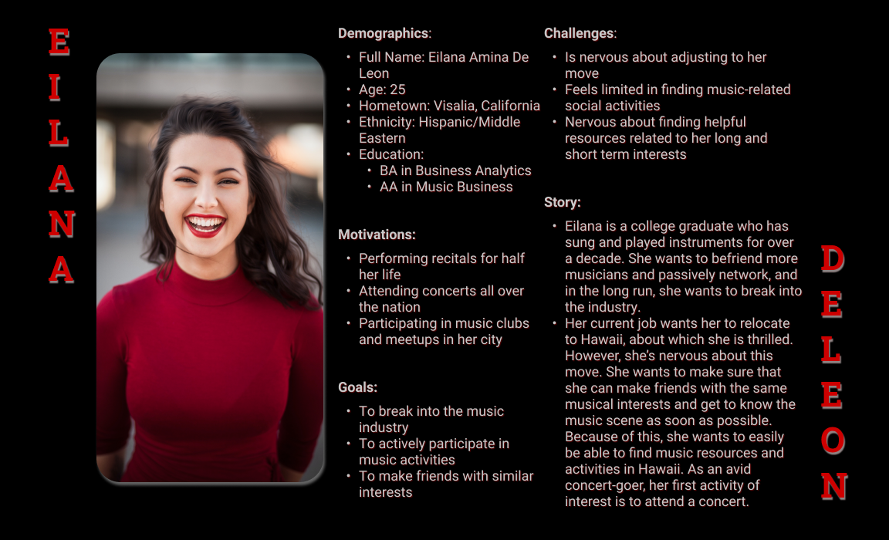

# Creative Industry Resources for Visitors and Residents of Hawaii
## Assignment 04: User Personas, Stories, and Scenarios
Diana Alamari | Digital Humanities 110 | User Experience and Design | Fall 2021

### Purpose of UX Storytelling
UX Stories allow designers to envision user needs and pain points with empathy. By learning the emotional perspectives of users, designers can transform written context into visual stories. Visial stories evoke emotional responses from target users. Users become allured with visuals that address their narratives. In order to create memorable experiences, designers must envoke a sense of feeling seen -- persuading users to invest time into their creation.

### Proposed Features
Based on previous heuristic and user-participant work, I would like to explore the following features:
1. Searching and filtering special creative events: Users will be able to tailor their search for particular events, activities, or career-based resources. 
2.  Interacting with fellow creatives through user-uploaded event posts: The app will allow for there to be a community section on the app. Also, users in the community are able to upload events for exclusive social oportunites not hosted (or posted yet) by official sources. When users post events, their name is listed as the creator of the post. This will allow for other users to get in touch with them, creating further social connections and networking opportunities.

## Personas and Empathy Maps

### Persona 1: Leo

/Eilana.png)

### Empathy Map

/Eilana-1.png)

### Persona 2: Eilana 

### Empathy Map

## Scenarios & Journey Maps

### Leo's Scenario - Searching and filtering creative events

/Eilana's%20Scenario_%20Why%20and%20How.png)

### Leo's Journey Map 
/Eilana's%20Journey%20Map.png)

### Eilana's Scenario - Interacting with fellow creatives through uploaded event posts

### Eilana's Journey Map

## Reflection
I enjoyed the process of creating personas and stories. By going through details of their personas, empathy maps, scenarios, and journey maps, I felt a sense of connecting with potential users of my app. It is important for designers to be build a connection with targeted users. I did build pretty peculiar personas -- but honestly, I also have experience meeting people who are very, very similar to these user profiles. There is definitely an appeal for such a comprehensive creative app because of its broad creative appeal; however, working on user challenges really did require creative input into the development of individual personas.
