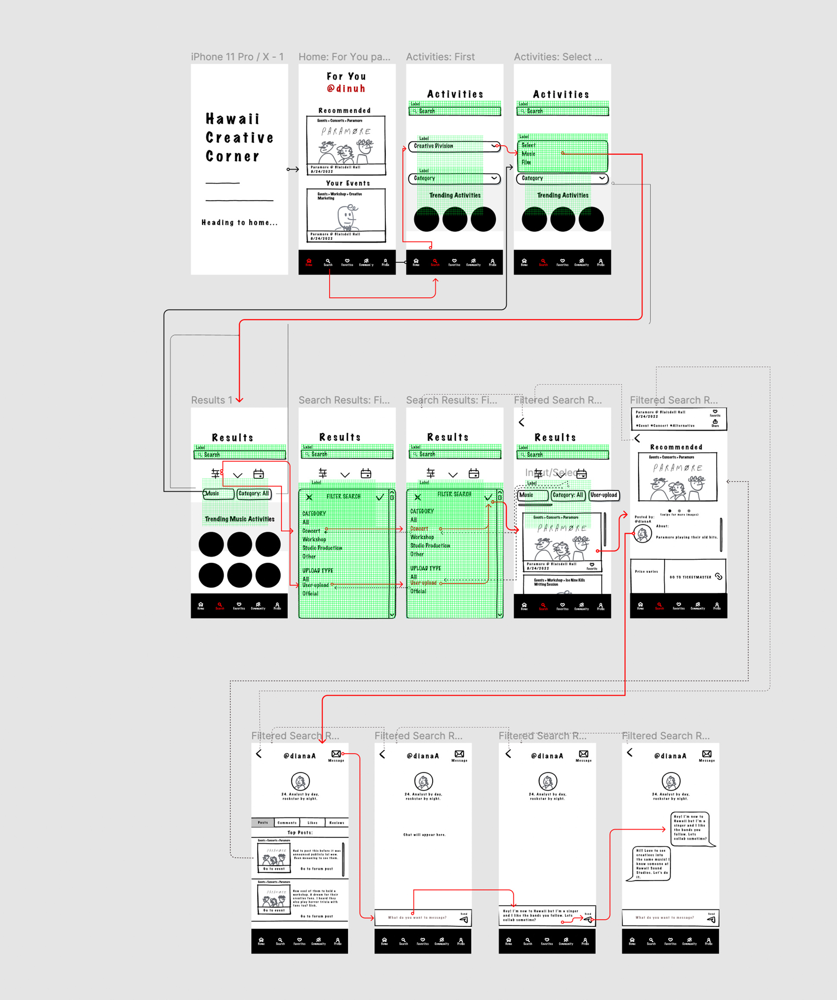

As I went through the user research process with the Hawaii Industries website, I was able to evaluate problems amongst users that I would like to address. Particular weaknesses revolve around the lack of useful creative resources and clear contextual information. In particular, problems include:

1. Resource links that were provided were outdated or nonfunctioning
2. Resource links were not relevant to what the average creative interested in Hawaii activities would want
3. Resource links provided under the "music" page and resource page lacked contextual information/detail, leading users to not know what they would be clicking.

To determine what the average user might want, I made inferences through heuristic evaluation and through input from participant observation. Then, I had to execute my findings into practical user scenarios. The personas I created allowed me to see what the typical user of the app might look like -- at a basic level, the typical user likely is technically savy, social, and creative. The behavioral pattern to be addressed is a user with that profile being unable to find a website that provides them with creative and social resources.

This process was foundational to start low-fidelity prototyping; I needed to comprehend a user's journey to provide me the ability to visualize desirable components of an app. Lo-fi prototyping allows designers to test and improve upon tentative functions proposed on an interface. My low-fidelity prototyping aims to address the typical user's problems by allowing them to find upcoming events through a community of people with common interests.

The two main tasks that will ultimately be prototyped are:
1. The ability to search for a creative event relevant to the user's interests
2. The ability to contact others associated with the event.

Testing

I recruited a participant to test this prototype's features and bugs. The process is demonstrated below.

(pictures of their walk through)

The user understood this part.
Although the user got confused at this part.

The user took an unexpected turn at -- as I intended for them to go to the frame that says "---". 

### Reflection
The process overall went well. The participant's confusion wasn't as expect at ---. However, I now know to improve upon ---. I also know to clean up ----. 
